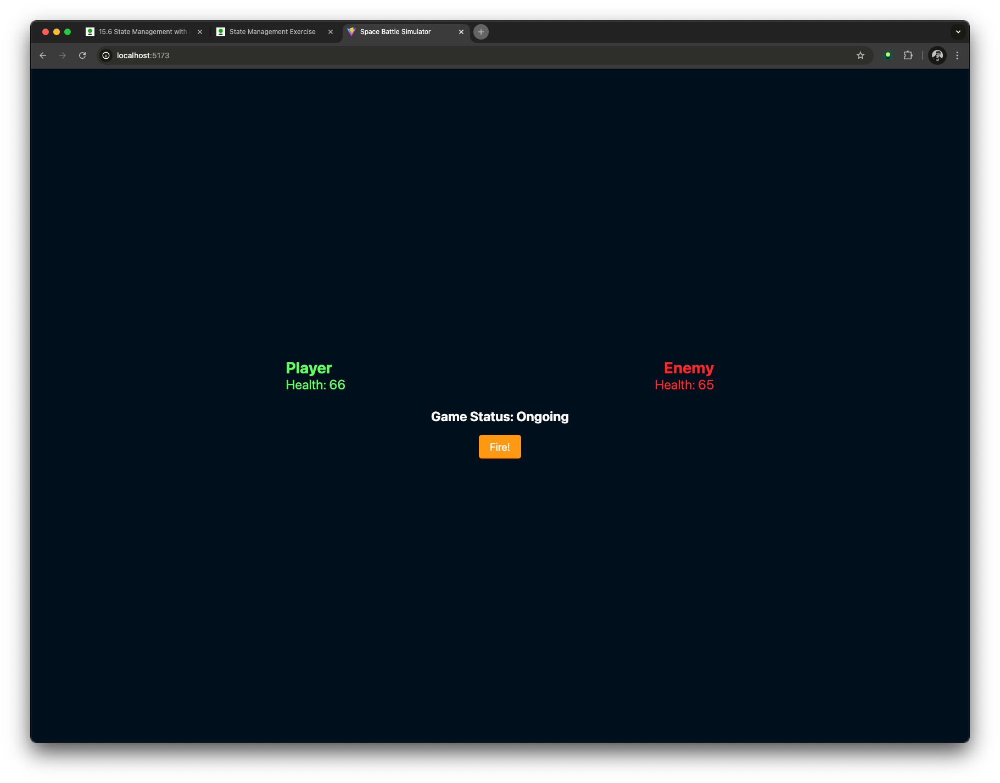

# 🚀 Space Battle Simulator

A simple **turn-based space battle simulator** built with **React**.

## 🛠 Features

- Players take turns attacking until one ship is destroyed.
- Randomized damage values for both player and enemy.
- Displays game status (Win, Lose, or Draw).
- Restart button to play again.

## 📷 Screenshot

 <!-- Add a real screenshot later -->

## 🛠 Installation & Setup

1. Clone the repository:
   ```bash
   git clone https://github.com/yourusername/space-battle-simulator.git
   ```
